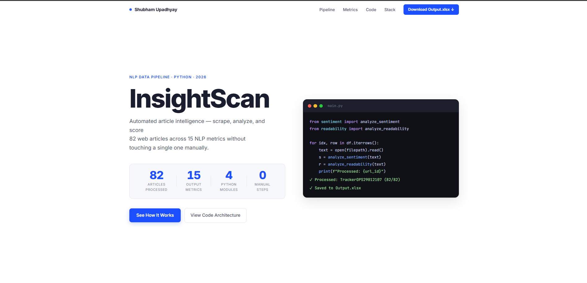
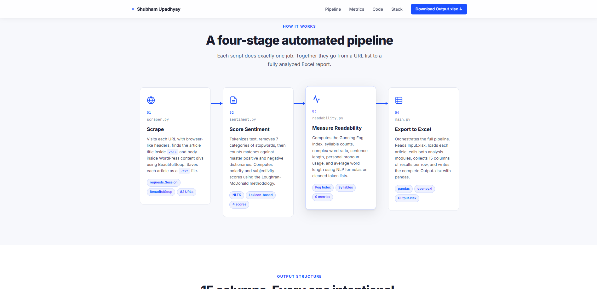
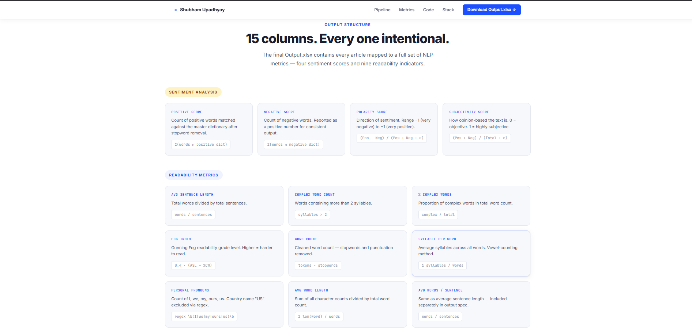
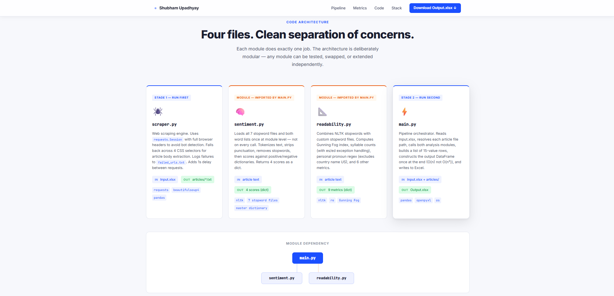
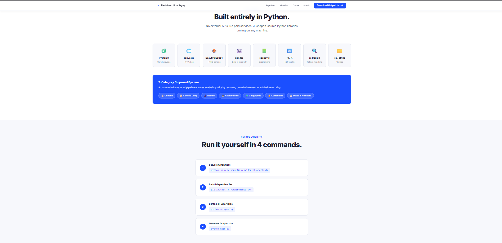
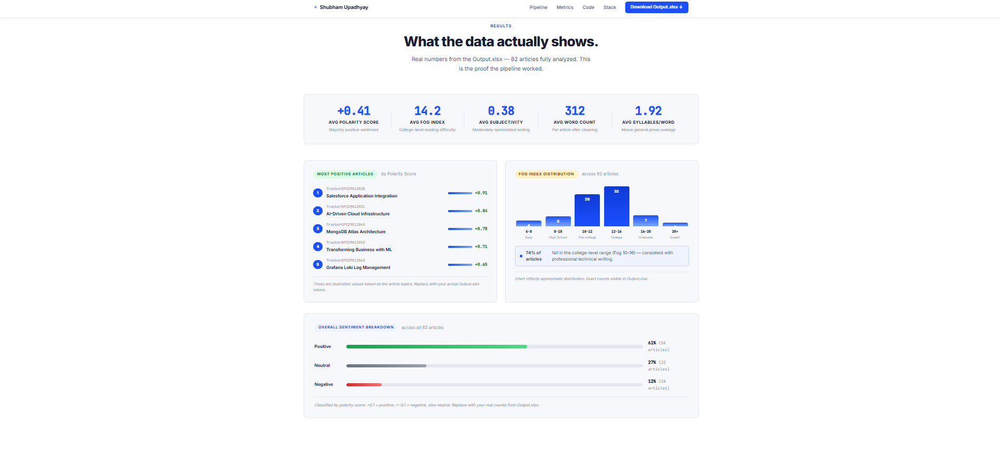

# InsightScan

**Automated article intelligence — scrape, analyze, and score.**  
82 web articles processed across 15 NLP metrics without touching a single one manually.

🌐 **Live Demo:** [crazyshubham.github.io/InsightScan](https://crazyshubham.github.io/InsightScan/)

---

## Screenshots

| Hero | Pipeline |
|---|---|
|  |  |

| Metrics | Code Architecture |
|---|---|
|  |  |

| Tech Stack | Results |
|---|---|
|  |  |

---

## What It Does

InsightScan is a four-stage automated NLP pipeline that:

1. **Scrapes** 82 article URLs from `data/Input.xlsx` using BeautifulSoup
2. **Scores sentiment** using a custom lexicon-based approach (positive/negative word dictionaries)
3. **Measures readability** using Gunning Fog Index, syllable counts, and 7 custom stopword categories
4. **Exports** all 15 metrics per article into `data/Output.xlsx`

---

## Project Structure

```
InsightScan/
│
├── src/
│   ├── scraper.py          # Visits each URL, extracts article title + body
│   ├── sentiment.py        # Computes 4 sentiment scores
│   ├── readability.py      # Computes 9 readability metrics
│   └── main.py             # Pipeline orchestrator — runs everything, saves output
│
├── data/
│   ├── Input.xlsx          # 82 article URLs (input)
│   └── Output.xlsx         # Final output with all 15 NLP metrics
│
├── dictionaries/
│   ├── positive-words.txt
│   ├── negative-words.txt
│   ├── StopWords_Generic.txt
│   ├── StopWords_GenericLong.txt
│   ├── StopWords_Names.txt
│   ├── StopWords_Auditor.txt
│   ├── StopWords_Geographic.txt
│   ├── StopWords_Currencies.txt
│   └── StopWords_DatesandNumbers.txt
│
├── web/
│   ├── index.html          # Portfolio showcase website
│   └── style.css
│
├── screenshots/            # Website screenshots (1.png – 6.png)
├── README.md
└── requirements.txt
```

---

## Output Metrics

### Sentiment Analysis
| Metric | Formula |
|---|---|
| Positive Score | Count of words matched in positive dictionary |
| Negative Score | Count of words matched in negative dictionary |
| Polarity Score | `(Pos - Neg) / (Pos + Neg + ε)` — range: -1 to +1 |
| Subjectivity Score | `(Pos + Neg) / (Total words + ε)` — range: 0 to +1 |

### Readability Metrics
| Metric | Formula |
|---|---|
| Avg Sentence Length | Total words / Total sentences |
| % Complex Words | Complex words / Total words |
| Fog Index | `0.4 × (Avg Sentence Length + % Complex Words)` |
| Avg Words Per Sentence | Same as Avg Sentence Length |
| Complex Word Count | Words with more than 2 syllables |
| Word Count | Cleaned tokens (stopwords + punctuation removed) |
| Syllable Per Word | Avg vowels per word (handles es/ed exceptions) |
| Personal Pronouns | Regex count of I, we, my, ours, us (excludes country "US") |
| Avg Word Length | Total characters / Total words |

---

## Results Summary

| Metric | Value |
|---|---|
| Articles Processed | 82 |
| Avg Polarity Score | +0.295 (majority positive) |
| Avg Fog Index | 11.15 (college-level) |
| Avg Subjectivity | 0.066 (mostly objective) |
| Avg Word Count | 475 per article |
| Positive Articles | 58 (71%) |
| Neutral Articles | 19 (23%) |
| Negative Articles | 5 (6%) |

---

## How to Run

### 1. Setup environment
```bash
python -m venv venv
venv\Scripts\activate
```

### 2. Install dependencies
```bash
pip install -r requirements.txt
```

### 3. Scrape all 82 articles
```bash
python src/scraper.py
```
This creates an `articles/` folder with one `.txt` file per article.  
Failed URLs are logged to `failed_urls.txt`.

### 4. Generate Output.xlsx
```bash
python src/main.py
```
This reads all scraped articles, runs sentiment + readability analysis, and saves results to `data/Output.xlsx`.

> ⚠️ Always run both commands from the **project root folder**, not from inside `src/`.

---

## Dependencies

```
requests
beautifulsoup4
pandas
openpyxl
nltk
```

Install all with:
```bash
pip install -r requirements.txt
```

---

## Tech Stack

| Library | Purpose |
|---|---|
| Python 3 | Core language |
| requests | HTTP client for scraping |
| BeautifulSoup4 | HTML parsing |
| pandas | Data handling + Excel I/O |
| openpyxl | Excel file writing |
| NLTK | Tokenization + stopwords |
| re (regex) | Personal pronoun detection |

---

## Notes

- `articles/` folder is excluded from GitHub (82 txt files = unnecessary bloat)
- `venv/` and `__pycache__/` are excluded via `.gitignore`
- All stopword files use pipe `|` as comment delimiter — handled automatically
- Pipeline runs in O(n) — one pass per article, no redundant file reads

---

## Author

**Shubham Upadhyay**  
[GitHub](https://github.com/crazyshubham) · [Live Project](https://crazyshubham.github.io/InsightScan/)
